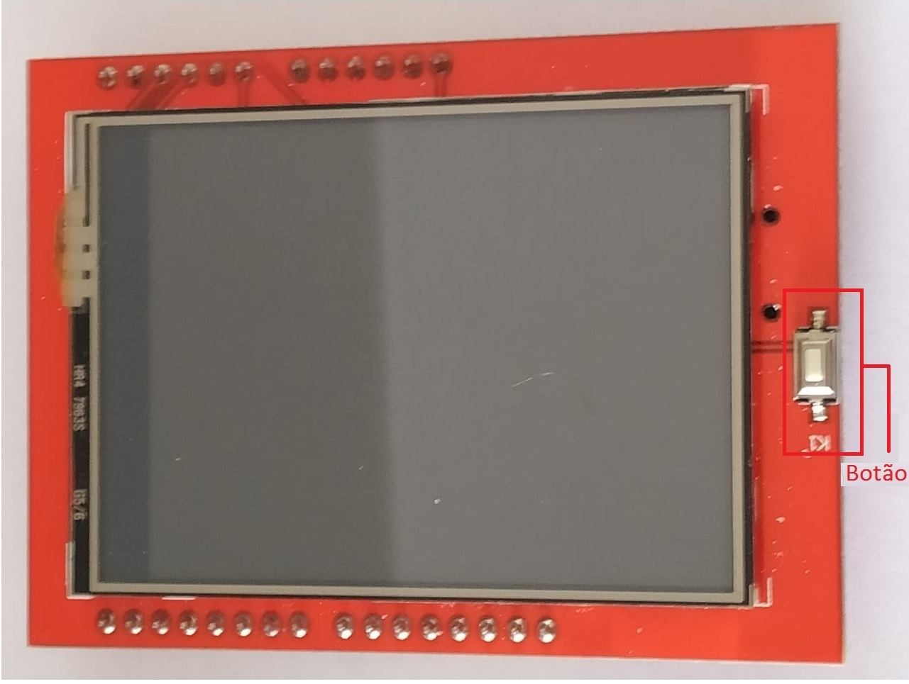
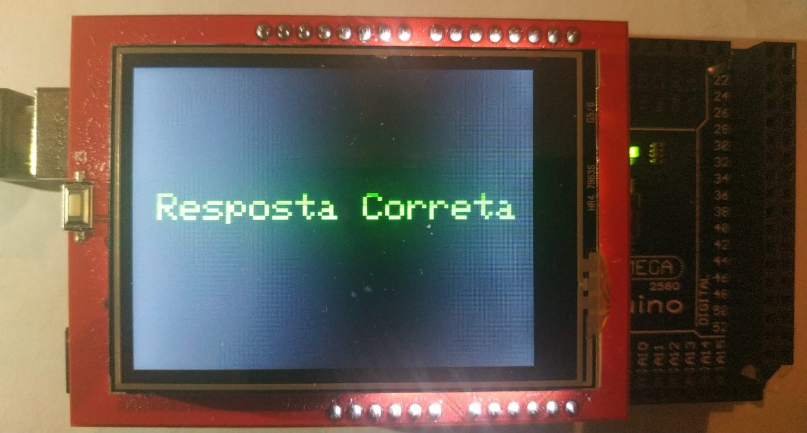

# Gramatic-Bô :robot:
Projeto de extensão da *Oficinas de Leitura e Produção de Textos: Construindo Materiais Concretos Para o Ensino*. Este projeto foi uma parceria entre os departamentos de Ciências da Computação e de Letras na Universidade de Brasília.

O projeto consiste em um jogo voltado a disciplina de português em escolas públicas. Foram utilizadas uma placa *Arduino Mega* e uma tela TFT com função *touch screen* para o desenvolvimento do projeto.

O jogo possui dois exercícios, um de análise sintática e outro de estudo da vírgula, divididos em níveis de dificuldade. 

Escolhendo o exercício de análise sintática, o aluno pode escolher por qual nível irá começar, voltar para a tela anterior ou ver a tabela de pontos. Escolhendo um dos níveis e jogando até o fim, seus pontos são salvo. Caso deseja sair do nível em que está sem terminar todas as frases, os pontos daquele nível de dificuldade não são salvos e o aluno pode jogar aquele nível depois, desde o início.

Cada frase terá um do termos destacados em azul e o restante em preto, o aluno deve escolher entre as opções **Sujeito**, **Verbo**, **Complemento** (podendo ser nominal ou verbal), **Predicativo** (sujeito ou objeto) e **Adjunto Adverbial**. Todos os termos da frase serão destacados em algum momento para que o aluno possa analisar e responder. Na parte inferior da tela há uma numeração (A/B) indicando a frase atual (A) e o total de frases do nível escolhido (B).

Escolhendo o exercício de estudo da vírgula, o aluno também pode escolher um dos níveis de dificuldade, voltar para a tela anterior ou ver a tabela de pontos. Assim como no exercício de análise sintática, o aluno pode jogar todas as frases para ter seus pontos daquele nível salvos ou sair. 

Nos exercícios de vírgula dois termos são destacados, um em rosa e outro em azul, e o aluno deve dizer se deve ou não ter uma vírgula entre os dois termos.

Quando o aluno acerta qualquer questão, na tela aparece uma mensagem dizendo que ele acertou e segue para a próxima questão. Caso erre, uma mensagem indica o erro e o aluno tem a opção de tentar novamente ou de seguir para a próxima questão.

Quando o aluno decide encerrar após terminar os exercícios ou escolher a opção de ver a pontuação, uma tabela com os pontos obtidos é mostrada na tela. A tabela mostra a pontuação obtida no nível do exercício sobre a pontuação máxima que se pode obter.

Este projeto foi orientado pela professora Eloisa Pilati, do departamento de Letras, em parceria com o professor Wilson Veneziano. As graduandas em Letras Carolina Pires, Luciana Santos e Marcella Silva ficaram encarregadas de criarem as frases para o jogo bem como opinarem sobre mudanças no *layout*, correção e andamento do jogo. O graduando Calebe Marinho foi responsável pelo *design* exterior para o robô.

